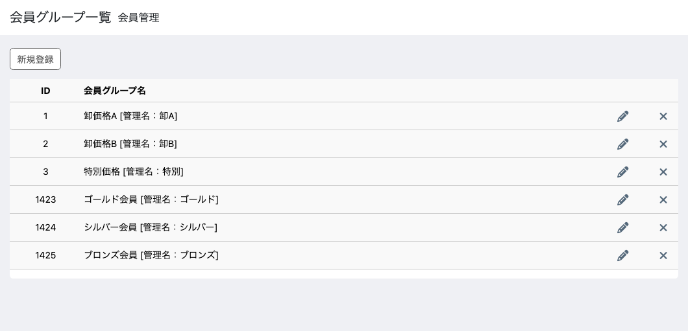
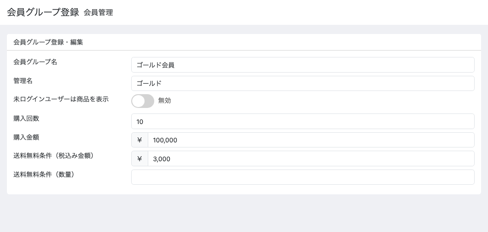

# 会員グループ管理::会員ランク管理アドオン for EC-CUBE 4.4

購入実績に応じて会員グループを自動で入れ替える EC-CUBE 4.4 用プラグインです。
[会員グループ管理プラグイン](https://github.com/kurozumi/eccube-plugin-customer-group) (CustomerGroup44) の拡張アドオンとして動作します。

---

## 何のためのプラグインか

会員グループは、そのままだと管理者が手で付け外しします。「10万円買った人をゴールドに
上げる」を人手でやるのは現実的ではありません。

このプラグインは、購入回数と購入金額から**ログインのたびにグループを付け替えます。**

- ゴールド・シルバー・ブロンズのような会員ランクを作る
- ランクごとに価格や送料無料条件を変える
- 実績が伸びたら自動で上のランクへ、条件を割ったら下のランクへ

会員グループ管理の仕組みに乗るので、**ランクごとの価格・閲覧できる商品・配送方法・
支払方法は、それぞれのアドオンがそのまま面倒を見ます。**

---

## 主な機能

| 機能 | 内容 |
|---|---|
| **ランクの自動割り当て** | 購入回数・購入金額の条件を満たすグループを、ログイン時に割り当てる |
| **送料無料条件** | 会員グループごとに「いくら以上」「何個以上」で送料無料にする |
| **判定の差し替え** | 条件を自分で書ける。最終購入日で降格させる、といった運用にも対応できる |

---

## ランクの決まり方

会員グループに**購入回数**と**購入金額**を設定します。会員の実績がその条件を満たせば、
そのグループが候補になります。

候補が複数あるときは、**会員グループ一覧の並び順で最上位のもの**が1つだけ選ばれます。
上にあるグループほど優先されるので、**ランクは上位から順に並べてください。**



### 割り当てのタイミング

**会員がログインしたとき**です。購入した直後ではありません。買ったあと次にログイン
したときに反映されます。

### ランクが管理するグループと、しないグループ

**購入回数か購入金額のどちらかが入っているグループだけ**をランク用とみなし、
付け外しします。どちらも空のグループには手を触れません。

これは大事な性質です。卸価格や限定商品のために手で割り当てたグループ、会員登録の
ときに入れたグループは、ログインしても消えません。

> 以前のバージョンは所属グループをすべて消してから付け直していました。購入実績の
> 条件を持たないグループは条件に決して一致しないため、**手で割り当てたグループが
> ログインのたびに失われ、二度と戻りませんでした。** 会員グループは価格・閲覧可否・
> 配送・支払方法を左右するので、ランクが管理していないものは触らないようにしています。

---

## 画面

### 会員グループにランクの条件を設定する（会員管理 → 会員グループ編集）


購入回数と購入金額は **AND** です。両方を満たしたときに候補になります。片方だけを
使いたいなら、もう一方は空にしてください。

### 送料無料条件


金額と数量のどちらか一方を満たせば送料無料になります。ゴールドは3,000円以上、
シルバーは5,000円以上、といった差を付けられます。

### 会員グループ編集の全体



---

## 動作要件

- EC-CUBE **4.4** 系
- 会員グループ管理プラグイン (`ec-cube/customergroup44`) ^4.4 が有効化されていること
- PHP 8.2 / 8.3

---

## インストール

```
composer require ec-cube/customergrouprank44
bin/console eccube:plugin:install --code=CustomerGroupRank44
bin/console eccube:plugin:enable --code=CustomerGroupRank44
```

---

## 使い方

### 3段階のランクを作る

1. 会員管理 → 会員グループ登録 で「ゴールド会員」「シルバー会員」「ブロンズ会員」を作る
2. それぞれに購入回数と購入金額を入れる（ゴールド10回かつ10万円、シルバー5回かつ5万円、ブロンズ1回かつ1万円）
3. 会員グループ一覧で**ゴールドを上、ブロンズを下**に並べ替える

条件を満たすグループが複数あっても、いちばん上のものだけが付きます。10回・10万円の
会員はゴールドだけになります。

### ランクごとに卸価格を出す

[**会員グループ価格管理アドオン**](https://github.com/kurozumi/eccube-plugin-customer-group-price)を入れて、商品ごとにランクの価格を入れるか、ランクの
グループに割引率を設定します。ランクが上がると価格が切り替わります。

### ランクと関係のないグループを併用する

卸売の取引先には手で「卸価格A」を付け、そのグループには購入回数も購入金額も入れない
でおきます。**ランクの付け替えはこのグループを触りません。** 取引先はランクと卸価格の
両方を持てます。

---

## 判定を差し替える

条件を自分で書けます。既定は購入回数と購入金額ですが、「最終購入日から1か月過ぎたら
ランクから外す」といった判定にもできます。

`RankAssignerInterface` を実装したクラスを用意します。**書き方は
[拡張のサンプル](docs/extension-samples.md) を参照してください。**

```php
interface RankAssignerInterface
{
    public function assign(Customer $customer): void;
}
```

**登録は要りません。** `RankAssignerInterface` を実装したクラスを置けばタグは自動で付きます。

**priority を 99 以下**にすると、既定の実装（priority 100）より後に走ります。
付けたいときはクラスに書いてください。

```php
use Symfony\Component\DependencyInjection\Attribute\AsTaggedItem;

#[AsTaggedItem(priority: 99)]
class MyRankAssigner implements RankAssignerInterface
```

なお `#[AsTaggedItem]` の第1引数は `index` で、**タグ名ではありません。**
priority だけを名前付き引数で渡してください。

既定の実装は `PurchaseHistoryRankAssigner` です。付け外しの範囲を
ランク用グループに限る作りになっているので、自分で書くときも同じ配慮をおすすめします。

---

## 仕様上の制約

### 反映はログイン時だけ

購入した直後には変わりません。管理画面から会員を編集しても、ランクの再判定は走りません。
ログインしないまま実績が伸びた会員は、次にログインするまで前のランクのままです。

### 条件は購入回数と購入金額の AND

どちらか一方だけで判定したいときは、もう一方を空にしてください。「金額または回数」の
OR 判定は既定では作れません。必要なら判定を差し替えてください。

### 付くランクは1つだけ

条件を満たすグループが複数あっても、並び順で最上位の1つだけが付きます。

### 送料無料条件は会員グループごと

商品や配送方法ごとに変えることはできません。

---

## 関連プラグイン

- [**会員グループ管理**](https://github.com/kurozumi/eccube-plugin-customer-group) (`ec-cube/customergroup44`) — 土台。これが無いと動きません
- [**会員グループ価格管理**](https://github.com/kurozumi/eccube-plugin-customer-group-price) (`ec-cube/customergroupprice44`) — ランクごとの価格を出します
- [**配送方法制限**](https://github.com/kurozumi/eccube-plugin-customer-group-delivery) / [**支払方法制限**](https://github.com/kurozumi/eccube-plugin-customer-group-payment) — ランクごとに選べる配送方法・支払方法を変えます

---

## サポート / ライセンス

本プラグインはEC-CUBE 1サイトにてご利用ください。
ただし、本番環境・開発環境で兼用することは問題ございません。

カスタマイズ、または他社プラグインとの競合による動作不良につきましてはサポート対象外ですが、
要望の重要度によっては、不定期の改良版をリリースしますのでまずはお問い合わせください。

本プラグインを導入したことによる不具合や被った不利益につきましては一切責任を負いません。
ご理解の程よろしくお願いいたします。
