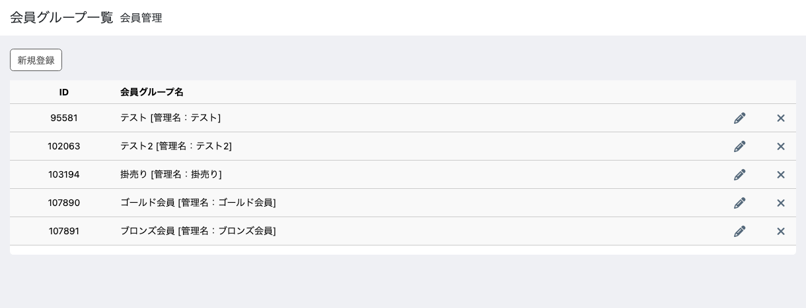

# 動作確認の手順

**入れたあとに、ひととおり動くかを見るための手順です。** 上から順に進めれば
一周します。所要 20 分ほど。

確認する画面と、そこで見るものを画像付きで並べてあります。**画像と違って
見えたら、その節の「見るところ」を読んでください。**

## 用意するもの

- 管理者のアカウント
- **購入実績のある会員**を2人。実績に差があるほうが分かりやすい
- 会員グループを手で1つ割り当てた会員（ランクが触らないことを見ます）

---

## 1. ランクのグループを作る

会員管理 → 会員グループ登録。2つ作ります。

| 名前 | 購入回数 | 購入金額 |
|---|---|---|
| ゴールド会員 | 3 | 300000 |
| ブロンズ会員 | 1 | 10000 |

会員グループ一覧で、**ゴールドを上、ブロンズを下**に並べ替えます。



### 見るところ

**この並び順がそのまま優先度です。** 条件を満たすグループが複数あっても、
いちばん上のものだけが付きます。ランクは上位から順に並べてください。

---

## 2. 条件は AND


**購入回数と購入金額の両方を満たしたときだけ**候補になります。

片方だけで判定したいときは、**もう一方を空にします。** 空欄は「この条件は
使わない」という意味です。

### 見るところ

**「金額だけ足りている会員」に上位ランクが付いていないか**を見てください。
3回かつ30万円のゴールドに、2回・33万円の会員が入っていたら、条件が OR で
効いています。卸価格を紐づけている店では実害が出ます。

---

## 3. ログインで付く

購入実績のある会員でフロントにログインします。

管理画面の会員編集を開くと、条件に合うランクが付いています。

### 見るところ

**割り当てはログインしたときです。買った直後ではありません。** 買ったあと
次にログインしたときに反映されます。管理画面から受注を足しただけでは
変わりません。

会員の購入回数・購入金額は `dtb_customer` の値を見ます。受注を手で
足したときは、そちらが更新されているか確かめてください。

---

## 4. 実績の違う会員で差が出る

実績の少ない会員でもログインします。

| 会員の実績 | 付くランク |
|---|---|
| 4回・539,250円 | ゴールド会員 |
| 2回・329,680円 | **ブロンズ会員**（金額は足りるが回数が足りない） |

### 見るところ

2人目にゴールドが付いたら、手順2の AND が効いていません。

---

## 5. 手で割り当てたグループは消えない

手順3・4の会員に、**購入回数も購入金額も入れていないグループ**を管理画面から
割り当てます。そのままもう一度ログインします。

**そのグループは残ったままで、ランクだけが付け替わります。**

### 見るところ

ここは以前に壊れていたところです。

> 以前のバージョンは所属グループをすべて消してから付け直していました。
> 購入実績の条件を持たないグループは条件に決して一致しないため、**手で
> 割り当てたグループがログインのたびに失われ、二度と戻りませんでした。**

会員グループは価格・閲覧可否・配送・支払方法を左右します。**卸価格の
グループが消えていないか**を必ず見てください。

「ランクが管理するグループ」の判定は、**購入回数か購入金額のどちらかが
入っているか**だけです。両方空のグループには手を触れません。

---

## 6. ランクは1つだけ

条件を満たすグループが複数あっても、**付くのは1つ**です。手順1のとおりに
ゴールドとブロンズの両方の条件を満たす会員でログインして、ゴールドだけが
付くことを確かめてください。

---

## 7. 送料無料条件


会員グループごとに「いくら以上」「何個以上」で送料無料にできます。
**金額と数量はどちらか一方を満たせば**無料になります（手順2の AND とは
別です）。

ゴールドは3,000円以上、ブロンズは10,000円以上、のように差を付けて、
それぞれの会員でカートの送料が変わることを確かめてください。

---

## 8. 判定を差し替える

```
php bin/console debug:container --tag=plugin.customer.group.rank
```

既定の `PurchaseHistoryRankAssigner`（priority 100）が出てくれば入っています。

**最終購入日から1か月過ぎたら降格させる**といった条件は、ここに足します。
例は [extension-samples.md](extension-samples.md) にあります。

---

## まとめて確認したいとき

| # | 画面 | 見るもの |
|---|---|---|
| 1 | 会員グループ一覧 | 並び順が優先度 |
| 2 | 会員グループ編集 | 購入回数と購入金額は **AND** |
| 3 | 会員編集 | **ログインしたとき**に付く |
| 4 | 会員編集 | 実績の差でランクが分かれる |
| 5 | 会員編集 | **手で割り当てたグループは消えない** |
| 6 | 会員編集 | 付くランクは1つ |
| 7 | カート | 送料無料条件がランクごとに効く |
